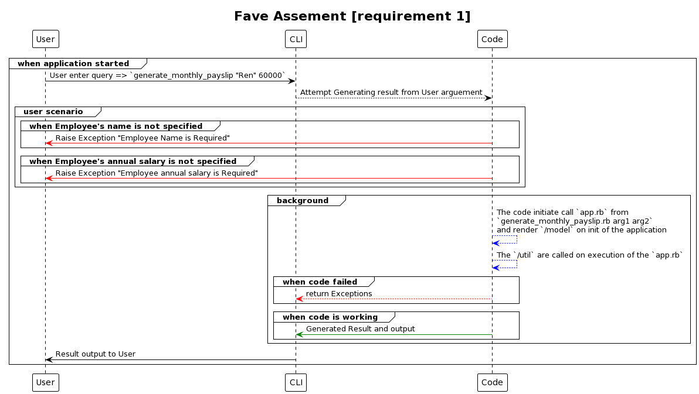
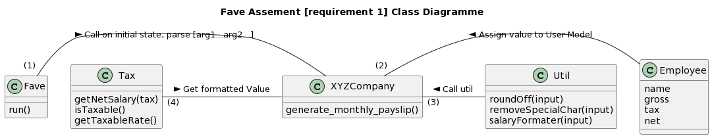

### FAVE ASSESMENT REQUIREMENT 1 

Deisgn Pattern: `Bridge`
Code Structure: `OOP`
Technology involved: `Ruby`, `UML`, `Docker`




#### The expected output 
``` 
    Monthly Payslip for: Ren
    Gross Monthly Income: $5000.00
    Monthly Income Tax: $500.00
    Net Monthly Income: $4500.00
```

#### Sample Execution
```bash
ruby generate_monthly_payslip.rb "Ren" 60000
```
> generate_monthly_payslip.rb {arg1} {arg2}
>> arg1 = Employee name (String)
>> arg2 = Employee annual salary (Float)